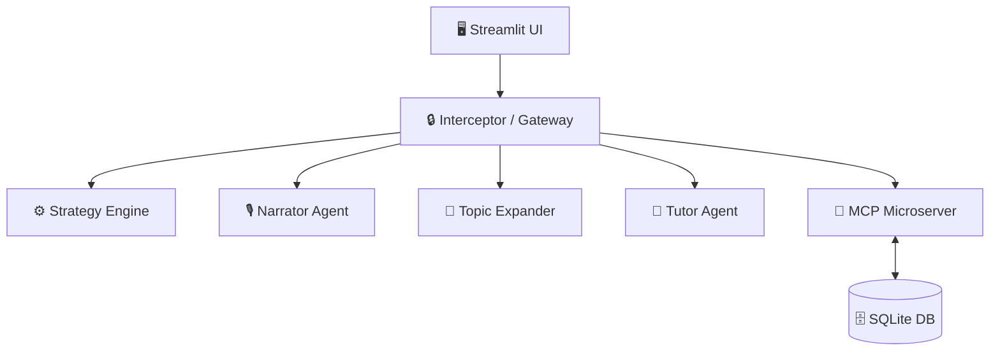

# PSAT/SAT Prep Interactive Timeline: AI-Powered Academic Planning

**PSAT/SAT Prep Interactive Timeline: AI-Powered Academic Planning** is a production-style multi-agent system designed to build fully personalized, adaptive SAT/PSAT study experiences. By leveraging a modular agentic architecture, it provides personalized, state-aware study timelines that adapt to individual student progress and performance.


---

## 🚀 Quick Links
* **[Live Demo](YOUR_STREAMLIT_URL_HERE)** — Try the interactive sandbox (no account required).
* **[Project Overview](YOUR_KAGGLE_OVERVIEW_URL_HERE)** — The narrative and design philosophy.
* **[Technical Architecture](YOUR_KAGGLE_ARCHITECTURE_URL_HERE)** — Deep dive into the multi-agent logic and MCP infrastructure.


## 💡 The "Why"
Most high school students lack access to personalized tutoring, leaving them to navigate a maze of generic prep materials. **PSAT/SAT Prep Interactive Timeline** bridges this gap by providing a system that knows a student’s grade level, target test date, and current mastery—building a custom plan that adapts in real-time as they learn.


## 🏗️ System Architecture
The application utilizes a decoupled, three-agent architecture coordinated via a centralized security **Zero-Trust Gateway (`interceptor.py`)**.



## 🤖 System Orchestration: The Agentic Core


| Agent / Skill | Capability (What it does) | Orchestration Pattern |
| :--- | :--- | :--- |
| **Narrator Agent** | Generates personalized, adaptive onboarding and time-aware study guidance. | **Dynamic Injection:** Context-aware prompting; utilizes dynamic windowing. |
| **Topic Expander** | Generates on-demand, deep-dive lessons for specific skills. | Cached LLM generation with grade-level tailoring. |
| **Tutor Agent** | Answers SAT/PSAT questions using official study materials. | Grounded RAG (Retrieval-Augmented Generation). |


---

## 🛠 Deterministic Skills Layer
Beyond the LLM agents, the system relies on six specialized, deterministic modules to ensure computational accuracy:

*   **Strategy Engine:** Multi-grade adaptive planner; maps grade-level to pacing, test cadence, and focus areas.
*   **Curriculum Mapper:** Dynamically distributes unmastered skills into a week-by-week timeline.
*   **Date Calculator:** Computes critical path milestones (defaults to Sept 15 of junior year).
*   **NMSI Calculator:** Implements state-specific cutoff lookups and proprietary scoring formulas.
*   **Syllabus Renderer:** Interactive state-management component that persists mastery to the DB.
*   **Calendar Export:** RFC 5545-compliant `.ics` generation using only Python standard libraries.

---

## 🛡 The Interceptor Gateway: True Decoupling
What makes this system a production-grade architecture is the **Zero-Trust Interceptor**. 

*   **Decoupled Execution:** Agents operate in total isolation—they do not import each other. 
*   **Centralized Routing:** All communication flows through the Interceptor gateway, which enforces rate limits and validates schema integrity.
*   **Validation & Control:** The Interceptor acts as the single point of truth for input sanitization and payload security.

This pattern mirrors **production-grade microservice architecture**, ensuring that individual agents can be updated, scaled, or replaced without impacting the stability of the core application.

---

## 🛠 Tech Stack

| Layer | Technology |
| :--- | :--- |
| **Framework** | Streamlit |
| **LLM Orchestration** | Google GenAI SDK |
| **Tooling** | Model Context Protocol (MCP) |
| **Data Validation** | Pydantic / Pydantic-Settings |
| **Authentication** | Bcrypt (Secure Hashing) |
| **Resiliency** | Tenacity (Retry Logic) |


---

## 🤖 Setup & Run Guide

> ## Prerequisites
>
>| Requirement | Version |
>|---|---|
>| Python | 3.11 or higher (3.14 used in dev) |
>| pip | bundled with Python |
>| Terminal | Two tabs/panes needed (MCP server + Streamlit app) |
>
>---
>
>## Step 1 — Clone and Navigate
>
>```bash
>git clone <your-repo-url>
>cd testprep_agent
>```
>
>---
>
>## Step 2 — Create a Virtual Environment
>
>```bash
>python3 -m venv venv
>source venv/bin/activate
>```
>
> [!NOTE]
> On Windows use `venv\Scripts\activate` instead.
>
>You should see `(venv)` at the start of your terminal prompt before continuing.
>
>---
>
>## Step 3 — Install Dependencies
>
>```bash
>pip3 install -r requirements.txt
>```
>
>This installs all required packages:
>
>| Package | Purpose |
>|---|---|
>| `streamlit` | UI framework |
>| `pandas` | Schedule DataFrame rendering |
>| `google-genai` | Gemini LLM client (Narrator, Tutor, Topic Expander) |
>| `tenacity` | Exponential backoff / retry logic for LLM calls |
>| `python-dotenv` | Loads `GEMINI_API_KEY` from `.env` at startup |
>| `bcrypt` | Secure PIN hashing (work factor 12) |
>| `mcp` | MCP server/client SDK |
>| `httpx` | HTTP transport for MCP SSE client |
>| `httpx-sse` | Server-Sent Events support for MCP client |
>
>---
>
>## Step 4 — Configure Environment Variables
>
>Create a `.env` file in the project root (it is gitignored — never commit it):
>
>```bash
>touch .env
>```
>
>Add your Gemini API key:
>
>```
>GEMINI_API_KEY=your_api_key_here
>```
>
> [!IMPORTANT]
> Get a free API key at [aistudio.google.com](https://aistudio.google.com/app/apikey).
> The app will run in **fallback mode** (hardcoded responses) if no key is set, but
> live AI narration, tutoring, and topic expansion will be disabled.
>
>---
>
>## Step 5 — Initialize the Database
>
>The database is auto-created on first run. You can also initialize it manually:
>
>```bash
>python3 db_setup.py
>```
>
>This creates `student_state.db` with all tables. It is safe to run multiple times (idempotent).
>
>A default account is seeded automatically:
>| Field | Value |
>|---|---|
>| Username | `student_001` |
>| PIN | `1234` |
>| Name | Alex |
>| State | WA |
>| Grad Year | 2028 |
>
>---
>
>## Step 6 — Run the Application
>
>The app requires **two terminal processes** running in parallel.
>
>### Terminal 1 — Start the MCP Microserver
>
>```bash
>source venv/bin/activate
>python3 mcp_server.py
>```
>
>You should see output similar to:
>```
>INFO:     Started server process
>INFO:     Uvicorn running on http://0.0.0.0:8000
>```
>
> [!NOTE]
> The MCP server handles all database reads and writes.
> If it's offline, the app automatically falls back to direct local function calls —
> so the app still works, but this process is recommended for production use.
>
>### Terminal 2 — Start the Streamlit App
>
>```bash
>source venv/bin/activate
>streamlit run app.py
>```
>
>The app opens automatically in your browser at:
>```
>http://localhost:8501
>```
>
>---
>
>## First Login
>
>| Mode | How |
>|---|---|
>| **Demo account** | Click **✨ Interactive Demo** — no setup required |
>| **Default account** | Username: `student_001` · PIN: `1234` |
>| **New account** | Switch to **Register** tab and create your own |
>
>---
>
>## Troubleshooting
>
>| Symptom | Fix |
>|---|---|
>| `ModuleNotFoundError` | Make sure `(venv)` is active and you ran `pip3 install -r requirements.txt` |
>| `GEMINI_API_KEY` errors | Check your `.env` file exists and the key has no extra spaces |
>| `Database file not found` | Run `python3 db_setup.py` once to create `student_state.db` |
>| MCP connection refused | Start `python3 mcp_server.py` in a separate terminal — app still works without it |
>| Port 8501 already in use | Run `streamlit run app.py --server.port 8502` |


## 🛡️ Built for Production

*  **Zero-Trust Gateway:** All requests are routed through process_secure_request() for authentication and rate limiting.
*  **Local MCP Protocol:** Decouples database logic, allowing for local fallback or remote SSE connectivity.
*  **Resilient Infrastructure:** Multi-layer caching and exponential backoff retry logic (tenacity) ensure stable performance despite API fluctuations.
*  **Ephemeral Guest Mode:** A secure sandbox environment for demonstration purposes with automated session teardown.


---

## 🚀 Deployment

Built for the Kaggle **AI Agents: Intensive Vibe Coding Capstone Project**, this application follows a **secure-first deployment strategy** using Streamlit Community Cloud with runtime secret injection to maintain environment integrity. Credentials are never hardcoded or stored in version control.

## 📜 License
This project is open-source and intended for educational planning purposes.

---

> *"Built by a Homeschool Parent for Precision: Every recommendation is grounded in the College Board Assessment Framework, processed through a Zero-Trust validation layer, and tailored to the student’s specific academic trajectory."*
